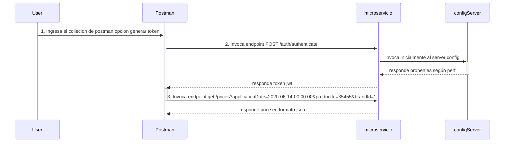

# reto-tecnico-max-leon
# Descripción

Este proyecto es una aplicación Java basada en la arquitectura hexagonal, api first, programación reactiva, desarrollada en Java 11 y utiliza diversas tecnologías para crear una solución robusta y eficiente. A continuación, se describen los aspectos clave del proyecto.

## Requisitos

Asegúrate de tener instalados los siguientes componentes antes de ejecutar el proyecto:

- Java 11
- Apache Maven 3.8.7
- Docker (opcional para ejecutar en contenedor)

## Detalles del Proyecto

- **Arquitectura Hexagonal**

- **Seguridad jwt Spring Security**

- **Configuración Centralizada Config Server**

- **Programación Reactiva**

- **Lombok para Mayor Claridad del Código**

- **Pruebas Integrales con Junit**

- **Pruebas de aceptación con Junit/Mockito**

- **Base de Datos H2**: con r2dbc para bd reactiva 

- **Documentación con Swagger**

  [http://localhost:8080/swagger-ui.html](http://localhost:8080/swagger-ui.html)

- **Docker para la Portabilidad**: El proyecto incluye un archivo Docker para ejecutar la aplicación en un contenedor Docker. Los comandos para construir y ejecutar la imagen del contenedor son los siguientes:

Nota: para el correcto funcionamiento se debe copiar el porperties en la ruta: /data/mcs/reto-tecnico-max-leon/reto-tecnico-max-leon-dev.yml

    ```bash
	docker build -t between-tech-max-leon:latest .
	docker run -d -p 8080:8080 between-tech-max-leon:latest
    ```
	
	Tambien se incluye un archivo docker-compose.yml:
	 ```bash
    docker-compose up -d --build
    ```

## Instalación

Sigue estos pasos para ejecutar la aplicación en tu entorno local:

1. tener instalado lombok
2. importar en postman la collection con nombre de archivo "Reto Tecnico Between.postman_collection.json"
3. importar los proyectos springboot maven tanto el de la carpeta config-server como el de microservicio en un ide (intelliJ fue el que se utilizó para su desallorro)
4. ejecutar el servicio config server 
5. importar y ejecutar el servicio microservicio/reto-tecnico-max-leon
6. probar desde postman el enpoint post localhost:8080/auth/authenticate ese endpoint genera un token
7. probar el endpoind el endpoint get localhost:8080/prices?applicationDate=2020-06-14-00.00.00&productId=35455&brandId=1

Nota: los porperties se necuentra en la ruta git: https://github.com/maxsoft21/service-configuration-reto-between

## Diagrama Secuencia:




## Diagrama solución:


